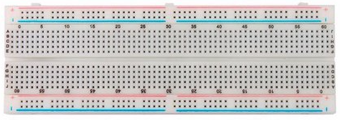
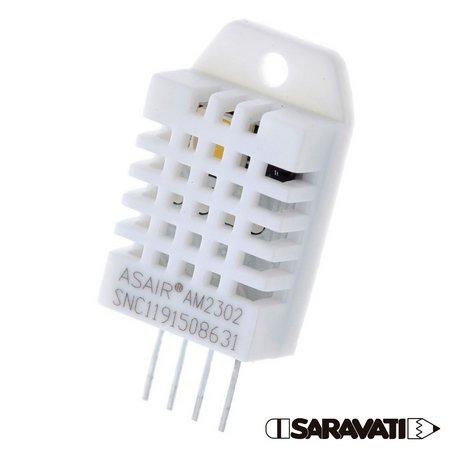

# Smartgrãos

O projeto consiste em um sistema de monitoramento de umidade e temperatura, que será utilizado nos locais de armazenamento de grãos, com sua medição podendo ser tanto no local, quanto remoto por meio de aplicativo. O intuito é aprimorar os meios de medição de dois dos fatores mais importantes para garantir a qualidade e redução da perda de carga, se iniciando na pós-colheita, acompanhando o transporte e finalizando no processo de embalar ou vender o produto.

# Materiais Utilizados:

# Módulo NodeMcu ESP-12E WiFi ESP8266 CP2102

# Descrição do Material

O Módulo NodeMCU ESP-12E WiFi ESP8266 CP2102 é uma placa de desenvolvimento equipada com CPU ESP8266 e Interface USB-Serial CP2102. A programação pode ser feita em LUA ou usando a IDE do Arduino através de um cabo micro-usb. Saravati(2021)
    O NodeMCU ESP-12E WiFi ESP8266 CP2102, é uma placa ideal para desenvolvedores de plataformas móveis, para projetos que exigem economia de espaço e energia. Ele fornece capacidade inigualável de incorporar recursos Wi-Fi em outros sistemas ou para aplicações independentes, com o menor custo e o mínimo de necessidade de espaço, é uma solução extremamente acessível ideal para aplicações IoT diversas (Figura 2). Saravati(2021).

# Especificações Técnicas

ESP8266 ESP-12E
MCU integrado de 32 bits de baixa potência
Conversor analógico digital (ADC) 10 bits integrado
SPI Flash 4MB
Clock: 80MHz à 160MHz
Wireless padrão 802.11 b/g/n
Antena Integrada
Conector Micro-USB
Interface usb-serial: CP2102
Modos de operação: STA/AP/STA+AP
Suporta 5 conexões TCP/IP
Portas GPIO: 11
GPIO com funções de PWM, I2C, SPI, etc
Tensão de operação: 4,5 ~ 9V
Taxa de transferência: 110-460800bps
Suporta Upgrade remoto de firmware
Tamanho: 50mm Largura x 27mm Profundidade x 7mm Altura

# Cabos Jumper Premium Macho / Macho

# Descrição do Material
Os Cabos Jumper Macho/Macho são indispensáveis para qualquer projeto de eletrônica, robótica e automação em geral. Muito utilizado em Protoboards ou Breadboards, também conhecidas como Matriz de contatos ou Placa de Ensaios, os Cabos Jumper são ideais para prototipagem e testes práticos. Saravati(2021).
  Os Cabos Jumper facilitam muito nas ligações entre os componentes eletrônicos, microcontroladores, Shields, Arduino e Raspberry, seja para seus projetos eletrônicos pessoais, trabalhos de faculdade ou cursos técnicos (Figura 3). Saravati(2021).

# Especificações Técnicas

Cabos Jumper Premium Macho/Macho 10cm
Modelo: Jumper Macho / Macho
10cm de comprimento
Terminais/Conectores: Dupont, padrão 2,54mm (Pino Macho nas duas pontas)
Secção do cabo condutor: 24 AWG - 0,2mm²
Material: Termoplásticos/Cobre/Estanho
Cor: Diversas
Tamanho: 100mm Largura x 65mm Profundidade x 5mm Altura 

# Cabo USB 2.0 para Arduino UNO tipo A/B

# Descrição do Material

O Cabo USB é essencial para executar a programação da plataforma de prototipagem Arduino. Com a crescente utilização do Arduino nos projetos robóticos e de automação residencial, que precisa ser conectado ao computador para ser programado, e como em suas embalagens originais, na grande maioria das vezes, o cabo USB não é fornecido pelo Fabricante, disponibilizamos para venda do Cabo USB para Arduino. Mercado Livre(2021)
O Cabo USB para Arduino é produzido em material de boa qualidade, o que propicia melhor conexão com o computador durante a programação. Mercado Livre(2021)
Compatível com o Arduino Uno, Mega e Uno SMD, o Cabo USB para Arduino é o produto que vai lhe auxiliar essencialmente na programação do seu projeto (Figura 4). Mercado Livre(2021)

# Especificações Técnicas

Conexão: USB A (M) x USB B (M)
Comprimento do cabo: 30Cm
Compatibilidade: Compatível com USB 1.1 e 2.0

# Protoboard 830 Pontos MB-102 Solderless Breadboard

# Descrição do Material

A Protoboard 830 pontos é ideal para montagem de projetos em aulas de laboratório e robótica, facilita o desenvolvimento e criação de circuitos eletrônicos para futuros projetos. Saravati(2021).
A Protoboard ou Breadboard, também conhecida como Placa de Ensaio ou Matriz de Contato, é um módulo com furos e conexões condutoras para montagem e teste de circuitos eletrônicos. A grande vantagem da placa de ensaio na montagem de circuitos eletrônicos é a facilidade de inserção e remoção dos componentes, uma vez que não há a necessidade de soldar (Figura 5). Saravati(2021).

# Especificações Técnicas

Protoboard 830 Pontos MB-102 Solderless Breadboard
Modelo: MB-102
Ideal para protótipos de circuitos eletrônicos para futuros projetos
Base adesivada
Furo padrão 0.8mm
Corrente máxima: 5A
Tensão máxima: 300V
Composição: ABS
Tamanho: 162mm Comprimento x 55mm Largura x 10mm de Altura
Peso: 72g

# Display LCD 1602A Backlight Azul

# Descrição do Material

O Display LCD 1602A Backlight Azul é uma tela de cristal líquido padrão industrial 16x2 com fundo azul iluminado, capaz de exibir 32 caracteres, sendo 16 em cada linha. O Display LCD 1602 é muito versátil e indispensável para qualquer dispositivo ou projeto eletrônico que necessite exibir informações e dados diversos (Figura 7). Saravati(2021).

# Especificações Técnicas

Display LCD 1602A Backlight Azul
Fundo Azul Iluminado
Cor dos Caracteres: Branco
16x2 (16 Caracteres por 2 Linhas)
32 Caracteres no total
Área de visualização: 64,5mm x 14,5mm
Controlador: HD44780
Tensão: 5V
Composição: Placa de Fenolite, Placas de Cristal e Componentes Eletrônicos
Tamanho: 80mm Largura x 36,5mm de Comprimento x 11mm de Altura
Peso: 29g

# Sensor de Temperatura DHT11 Digital

# Descrição do Material

O Sensor de Temperatura e Umidade Digital DHT11 é um pequeno sensor tipo resistivo com a capacidade de medir umidade e temperatura . O Sensor de Temperatura e Umidade Digital DHT11 pode ser utilizado com microcontroladores como Arduino, Raspberry Pi, PIC, ARM, etc, em projetos que utilizem detecção de umidade e temperatura, controle de ambientes climatizados, etc. (Figura 8). Saravati(2021).

# Especificações Técnicas

Sensor de Temperatura e Umidade Digital DHT11
Modelo: DHT11
Tensão de Operação: 3V ~ 5V DC
Pinagem: VCC - Positivo, GND - Negativo, OUT - Saída Serial
Faixa de medição de umidade: 20 a 95% UR
Faixa de medição de temperatura: 0º a 50ºC
Precisão de umidade de medição: ± 5,0% UR
Precisão de medição de temperatura: ± 2.0 ºC
Temperatura de operação:  -30°C a 70°C
Resolução: Temperatura e Umidade 16-bit
Tamanho: 23mm Largura x 12mm Profundidade x 5mm Altura 
Peso: 5g

